# Hidenza
A Haskell partial implementation of [Tyler Hobbs's Fidenza Algorithm](https://tylerxhobbs.com/fidenza)

## Motivation
Not being into NFTs at all, I've only very recently found out about the Fidenza algorithm, when it was mentioned as a prompt in [Genuary](https://genuary.art/) and I thought it looked wicked, so I read both the [flow field](https://tylerxhobbs.com/essays/2020/flow-fields) and [Fidenza](https://tylerxhobbs.com/fidenza) essays on Tyler's website in one breath. For the next couple of days I would find myself thinking about the ideas he mentioned and appreciating more and more how simple and yet clever they were.

That, paired with me only recently getting into this amazing programming language called [Haskell](https://www.haskell.org/) culminated into what you'll find in this repo.

## Quick run
In the `Usage` section below you can find information about all the arguments, but for the impatient ones, this should be enough to get the default arguments image, saved as `Fidenza.png`

`cabal run Fidenza -O2`

<p align="middle">
  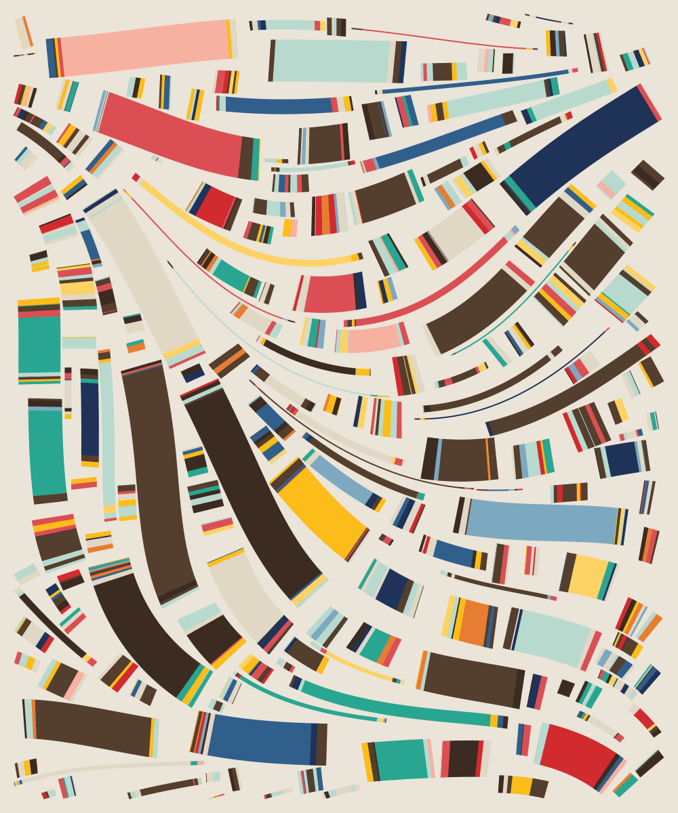
</p>

I've also included a python script - `makeRandomImages.py`, which generates random seeds and creates images from them, so you can leave that running for a while to produce a bunch of images. It was super exciting for me to come back half an hour later and look at everything that's been produced and every time there would be at least a few surprising ones.

Here are a few of my favourite ones

<p float="left" align="middle">
  
  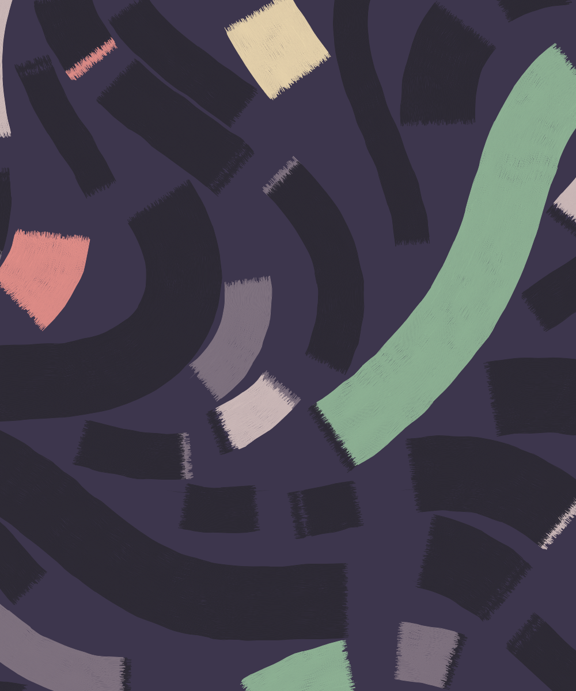 
  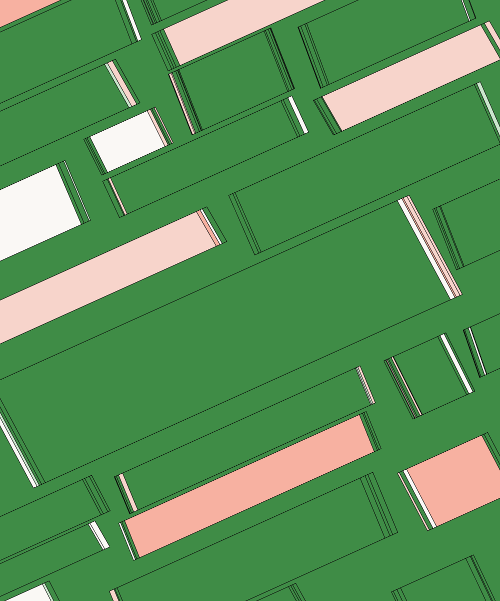
  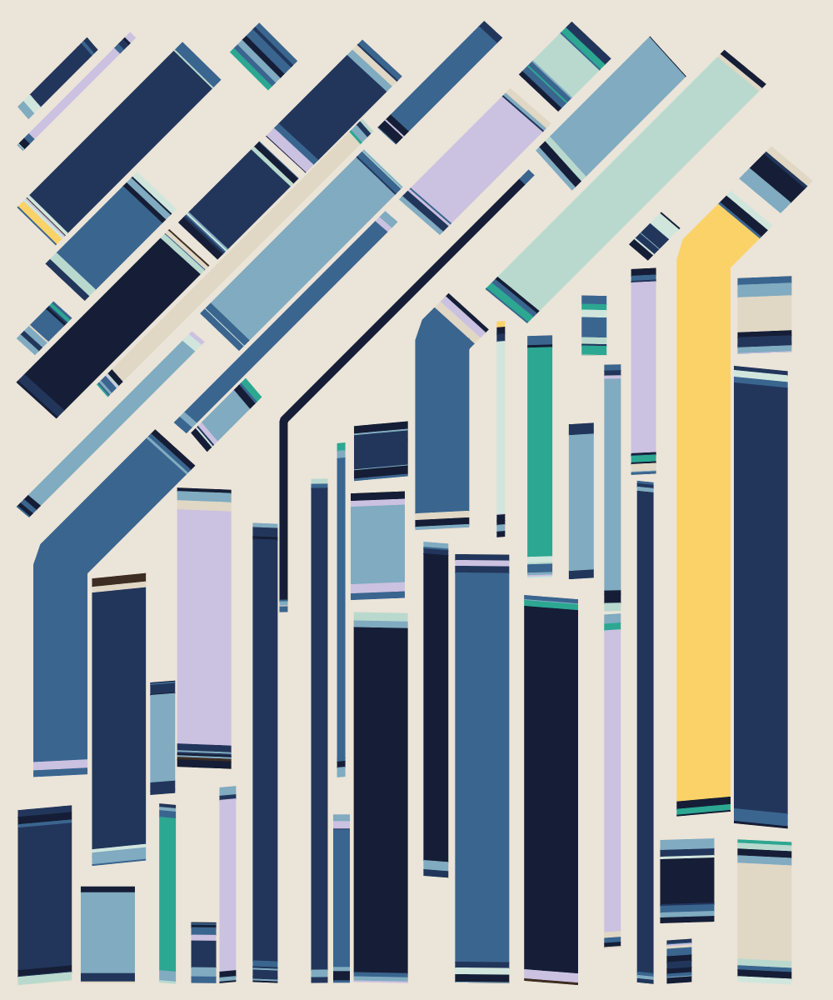
</p>

## Disclaimer
There's a couple of things I would like to get out of the way as soon as possible.

### Haskell beginner
Not going into too much depth here, I've only very recently gotten into Haskell and the functional programming paradigm, so I still find it quite hard to move away from the imperative mindset, which leads to some quite sloppy code that you can find here.

### Partial implementation
I say **partial** implementation of the algorithm, as I am missing 2 of the parameters defined in the original Fidenza - spirals and density - and 4 of the colour schemes - dark lifestyle, rose, party time and white mono.

The **spirals** argument is missing, as I couldn't figure out the exact spiral equation. The closest I've gotten (which is not super close as the center still looks quite different) is  

```
a / (theta ^ 0.7), where a = 100
                         0 < theta <= 14 * Pi
```

which is then rotated a bunch of times to fill in the whole image.  
  
You'll find that I do have some images including spirals and those have been produced using the above method. What I did was, take those spirals and convert them to a vector field, which I then passed in to the algorithm using the `FromFile` constructor for the `vectorFieldGenerator` argument, which you can find below. I've stored those vectors in the `spiral.vectors` file if anyone would like to give them a go.

<p align="middle">
  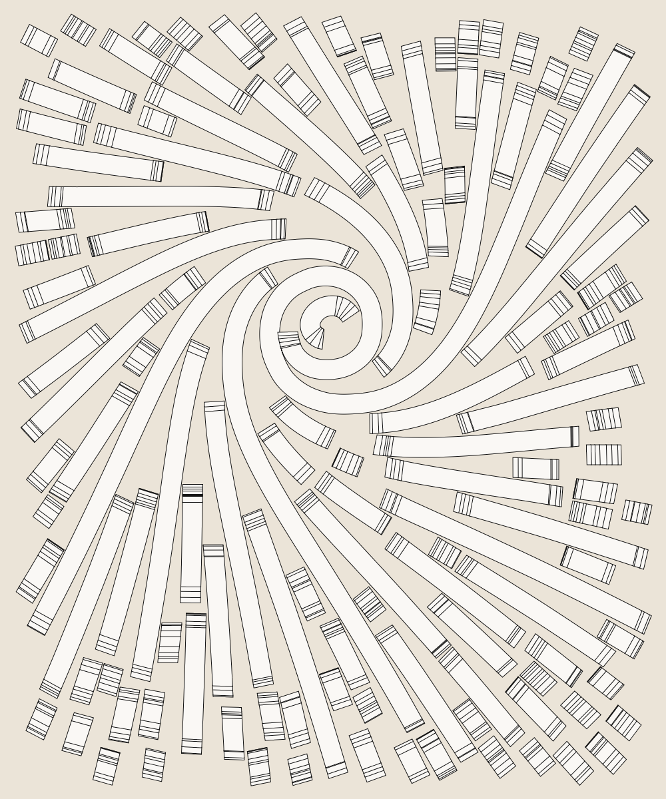
</p>

The other one is **density**. Judging by the flow fields essay, I presume that circle packing is used when generating the Fidenza curves, but my approach is significantly different and way lazier. I literally try to generate a new completely random curve up to `numGenerationAttempts` times, until one manages to survive enough iterations to get longer than the `minLength` argument. If that sounds like throwing shit at the wall until something sticks, it's because that's the exact mathetmatical intuition behind it.

The result of that generation method is that the density of the ribbons is a bit of a magical combination between the `widths`,`fertilities`,`width`,`height`,`collisionMargin`,`maxCurves`,`minLength` and `numGenerationAttempts` arguments.

For the most part, I've been able to recreate the various scales present in the original Fidenzas without too much tweaking and those are stored as presets in the `scale` simple argument, which you can also read about below.

| microUniform | small
| --- | --- 
| 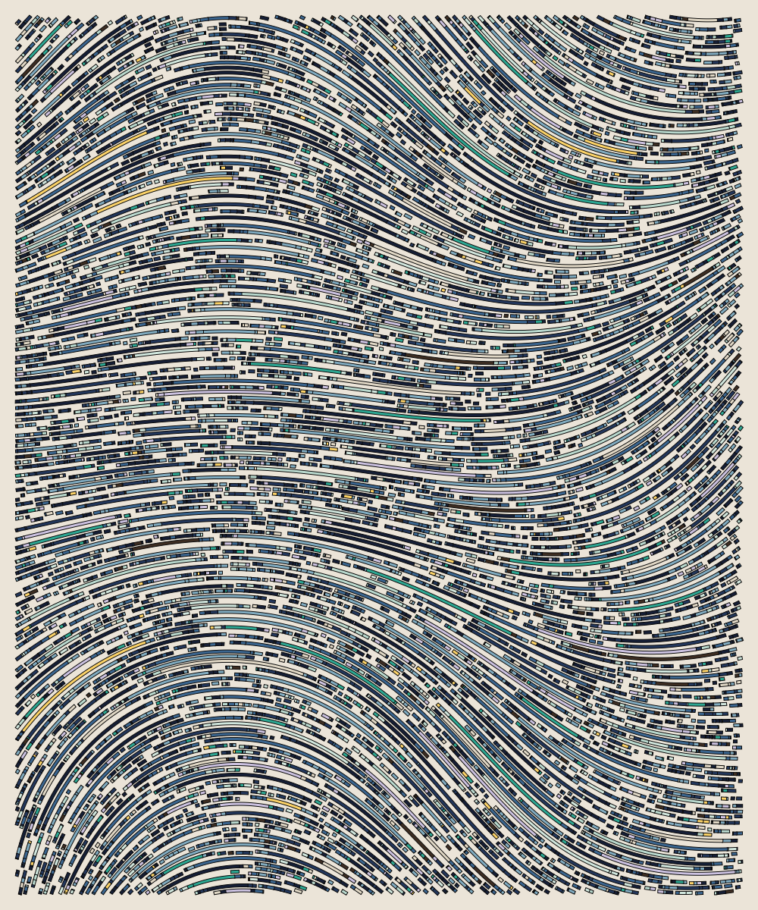 | 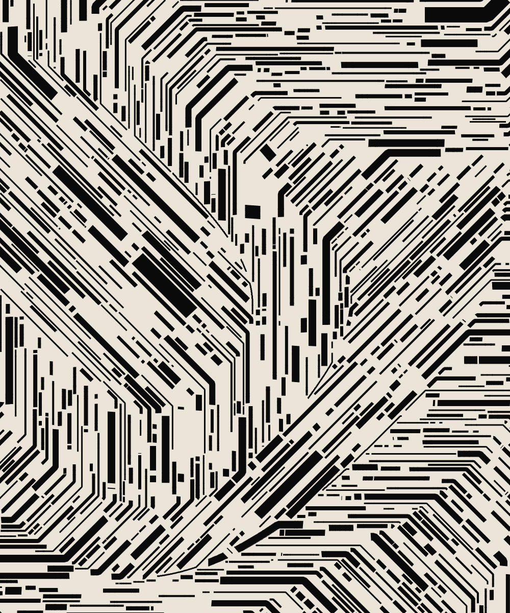 

| medium | uniform
| --- | ---
| 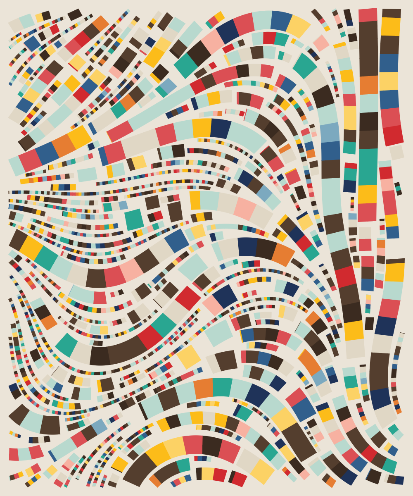 | 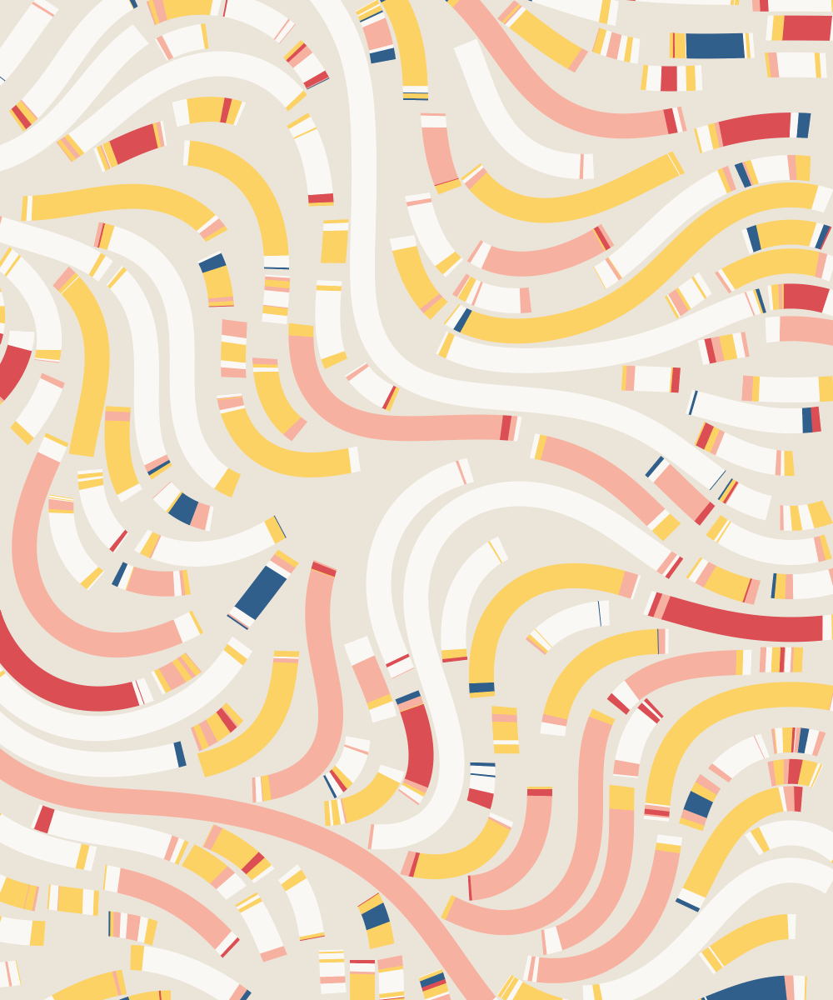

| large | jumbo
| --- | --- | ---
| 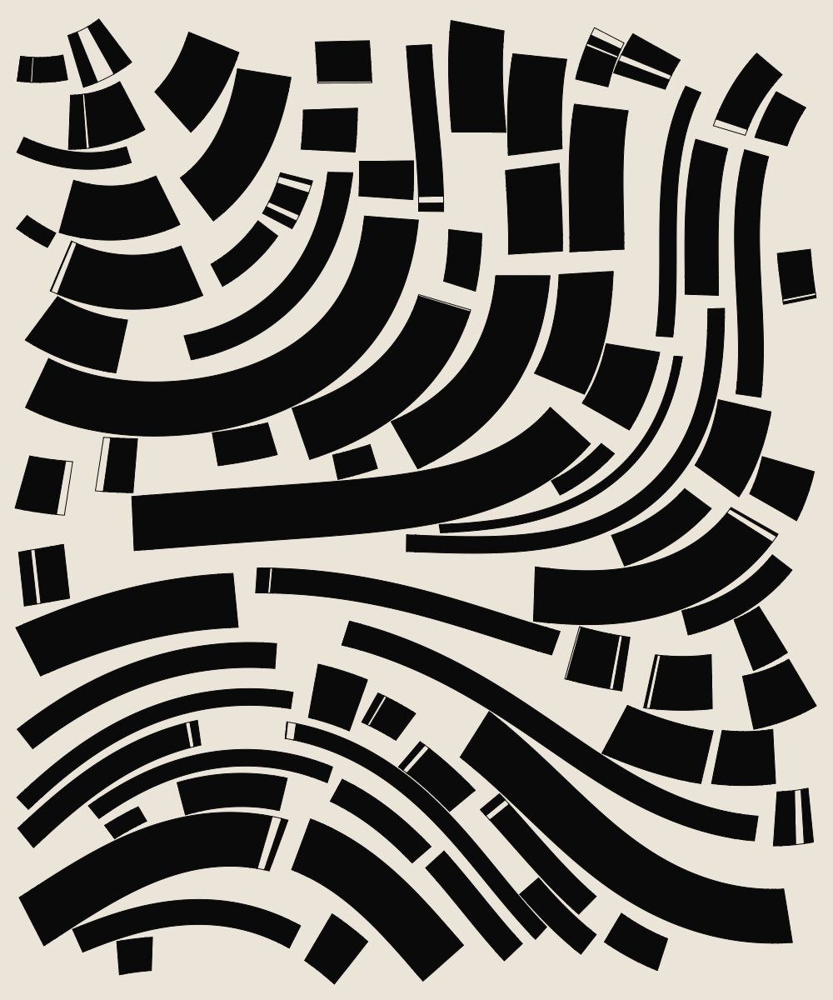 | 

| jumboXL
| ---
| 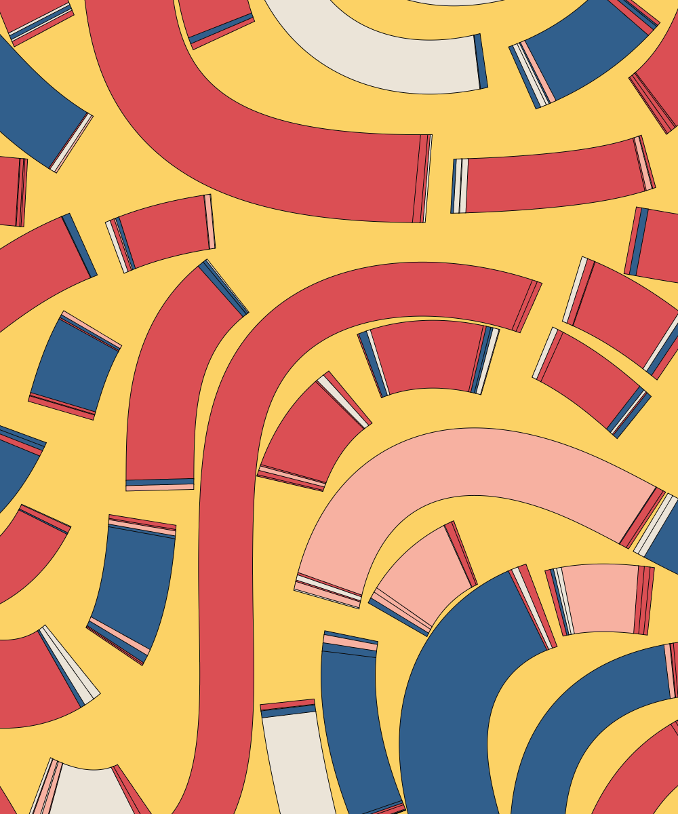

## Usage
Below is the help string for the executable which contains all the info you need for controlling your Fidenzas.

The section about _Simple Args_ contains the parameters as defined in the original Fidenza and provide the easiest way of controlling the algorithm.

```
A Haskell partial implementation of Tyler Hobbs's Fidenza algorithm.

Partial, as there currently is no support for creating spiral Fidenzas and for intuitive,
deterministic control over the density of Fidenzas.

The control over the density is achieved by tweaking the maximum number of curves and
the curve widths distribution, as if the image is already mostly filled up by shapes
and {numGenerationAttempts} attemps have failed to generate a new random ribbon, then
the algorithm ends.

A lot of arguments are of type distribution, which accepts 3 different kind of parameters:
   - a uniform distribution, specified by a list like so - [1,2,3,4,5,6], where
     each element has an equal probability of being chosen
   - a weighted distribution, specified by making each element a tuple like so:
     [(1,0.5),(2,0.1),(3,0.1),(4,0.1),(5,0.1),(6,0.1)], where the first member of
     each element is the value and the second is the probability of that value being chosen
   - a uniform distribution, specified by a range like so - (1,6,2), where
     the first number is the starting number, the second number is the end number and
     the third number is to step to keep taking from the starting number until you get to
     the end number. So (1,6,2) becomes [1,3,5].

Usage: (./Fidenza|cabal run Fidenza -- ) [ARGS] 

Ex:
  ./Fidenza --seed 1
  cabal run Fidenza -- --seed 1

Args:
   --avgBlockSize - whether to make all segments on a single curve the same.
      The range is (0,1). Default 0.0

   --chunkSizes - the distribution of chunk/segment sizes. Default (2,12,1)

   --chunksOverlap - when splitting into segments, we can choose to make them overlap a bit
     or choose to have a negative number which makes gaps between the segments. Default 1

   --collisionMargin - minimal distance between shapes. Default 2

   --colourScheme - the colour scheme as an id. See the list of colours at the
      Simple colour arg below. 9,10 and 11 are my own colour schemes. Default 0

   --customBgColour - the background colour in the format (r,g,b,a) with 0-255 values.
      Overrides the background of any defined colour schemes..

   --customColours - a custom colour palette in the format (r,g,b,a,probability)
      with 0-255 values for r,g,b and a and any type of relative probability.
      Overrides any colour scheme parameters. Default []

   --drawSoftly - whether to draw each shape by drawing many tiny strokes,
      rather than filling the whole shape, resulting in a soft,
      brush like looking shapes. Default 0

   --fertilities - the distribution of fertilities (how long a curve can get). Default (50,400,25)

   --height - image height. Default 1200

   --help - shows this help message.

   --maxCurves - a maximum number of curves before execution stops. Default 200

   --maxSteps - a way of limiting the execution, where one step is considered 
      the extension of any curve by one segment of length {stepLength}. Default 100000

   --minLength - the minimum number of {stepLength} long segments to accept 
      as a valid generated curve. Default 15

   --numGenerationAttempts - how many attempts to make when generating a new 
      curve before giving up. Default 1000

   --outlineColour - the colour of any outlines. Default (10,10,10,255)

   --outlineSize - the size of any outlines. Default 1

   --padding - minimal distance from a shape to the borders of the image. Default 20

   --randomBoil - randomly pushes shape points with this amount. Default 0

   --randomBoilSeed - the seed for the random boil. Uses a separate seed,
      so we can make small, silly boiling animations. Default 0

   --rotationOffset - rotates the whole vector field by this parameter. Default 0

   --seed - seed for the random generator. Default 0

   --skewAngles - the distribution of skewing angles applied to the segments
      when drawing. One angle per curve. Default (-0.1,0.1,0.01)

   --softMaxStrokes - maximum number of tiny strokes per curve. Default 220

   --softNumStrokesWidthRatio - multiplies the width of a curve by this to
      define the number of strokes per shape. Default 1.8

   --softPerlinFreq - the frequency/turbulence of the soft strokes. Default 0.016

   --softPerlinOfs - the offset of the soft strokes vector field,
      to allow (x,y) values outside of the img dimensions
      to have valid results. Default -300

   --softRandomOfsAlongPerp - how much to randomly push the tiny strokes
      along the perpendicular (normal) of the curve. Default 2

   --softRandomOfsAlongV - how much to randomly push the tiny strokes along
      along the direction of the curve. Default 6

   --softSeed - seed for the softness, so it can be animated. Default 0

   --softStepLength - how many stes of {stepLen} to group into one step
      for the tiny strokes. Default 11

   --squareBlocks - whether to make the segments along the ribbon square.
      The range is (0,1). Default 0.0

   --stepLength - how long of a step to make at every iteration.
      Inveresely proportional to resolution. Default 1

   --stopChunkingAt - controls the distance from start and end to stop 
      chunking the ribbon into segments at. The actual number is randomly 
      sampled between the left and right boundaries.
      Set this to something massive if you don't want segments. Default (5,15)

   --strokeOrFill - whether to outline each segment (0), fill the each segment (1),
      outline and fill each segment (2) or fill each segment and
      outline the whole ribbon. Default 1

   --vectorFieldGenerator - method for generating the underlying vector field
      Valid options are:
         - PerlinNoise {frequency} {offset}, where the offset
              is there to allow us to pass negative coordinates
              and still get a result
         - FromFile {filePath}, where the file has the follwoing forma:
              x11 y11 x12 y12 x13 y13 .. x1n y1n
              x21 y21 x22 y22 x23 y23 .. x2n y2n
              ..
              xm1 ym1 xm2 ym2 xm3 ym3 .. xmn ymn

              the m and n numbers are not necessary to be the same as the
              width and height of the image as they will be lerped
         - Horizontal - every point in the vector field returns (1,0)
         - Straight {angle} - every point in the vector field retuns (1,0)
              rotated by {angle}. Default PerlinNoise 0.001 -400

   --vectorFieldStepPiDivisor - if greater than 0, all angles will be rounded to 
      multiples of PI divided by this parameter. Default 0

   --width - image width. Default 1000

   --widths - the distribution of curve widths. Default (2,60,4)


Simple Args:
  If the simple flags are used, then the arguments accepted are significantly
  simplified and act as switches on defined presets of the arguments above.

  These presets are designed to resemble Tyler Hobbs's parameters as much as possible.

  It's important to note that the presets are evaluated first, and then any of the main
  arguments above, which means preset values can be overwritten by the main arguments.

  For example, the following command will NOT use the 'small' scale as specified by the
  preset, but instead use the widths provided afterwards.

  ./Fidenza --scale small --widths  [80,90]

   --collisionCheck - whether or not to allow collisions
      Valid options are noOverlap, relaxed and anythingGoes.

   --colours - colour scheme
      Valid options are luxe,rad,golfSocks,baked,politique,
      cool,am,whiteOnCream,blackAndWhite and derived+(any of the above).
        e.g. derivedAm or derivedBlackAndWhite.

   --haveMargin - whether we are constrained to the frame or allowed to go outside.

   --outlined - whether to add an outline to each segment.

   --scale - defines the size distribution of the ribbons
      Valid options are small,medium,large,jumbo,jumboXL,microUniform and uniform.

   --shapeAngles - whether the turns in the ribbons are smooth and sharp
      Valid options are curved and sharp..

   --softShapes - whether to draw the shapes with hundreds of small strokes, 
      resulting in a soft, brush like looking stroke. Valid options are yes and no.

   --superBlocks - whether to make the segments along the ribbon square
      Valid options are yes and no.

   --turbulence - how drastic the shape turns are. A more technical explanation 
      is that this parameter controls the frequency of the underlying 
      perlin noise vector field. Valid options are none,low,mid and high.
```

## License
Of course, full credit for the algorithm goes to [Tyler Hobbs](https://tylerxhobbs.com/).

This repo, though, is licensed under GPLv3.
